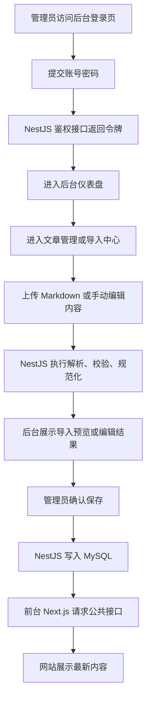

## 1. 产品概述
基于现有 `myinfo-site` 的内容规划，新增两个独立项目：`myinfo-api` 负责接口与内容管理能力，`myinfo-admin` 负责整站后台管理界面。
- 目标是将文章、日常、项目、站点资料从本地 Markdown 与常量配置迁移到 `NestJS + MySQL` 的可维护体系中。
- 产品价值在于让网站从“本地手改内容”升级为“后台可视化维护 + 统一接口消费”的完整内容平台。

## 2. 核心功能

### 2.1 用户角色
| 角色 | 注册方式 | 核心权限 |
|------|----------|----------|
| 超级管理员 | 预置账号 | 管理文章、项目、站点资料、导入任务、后台账号 |
| 编辑者 | 后台创建账号 | 管理文章、项目、站点资料，不可管理系统账号 |

### 2.2 功能模块
1. **后台登录页**：账号登录、令牌获取、会话保持
2. **后台仪表盘**：内容统计、最近更新、导入记录概览
3. **文章管理页**：文章/日常列表、筛选、编辑、删除、发布
4. **Markdown 导入页**：导入预校验、导入预览、确认入库、导入记录
5. **项目管理页**：项目列表、排序、推荐、增删改
6. **站点设置页**：站点资料、社交链接、地图坐标、对外链接维护
7. **公共内容接口**：面向前台站点的站点信息、文章、标签、项目接口
8. **后台管理接口**：面向后台管理端的鉴权、内容管理、导入、配置更新接口

### 2.3 页面详情
| 页面名称 | 模块名称 | 功能描述 |
|-----------|-------------|---------------------|
| 登录页 | 登录表单 | 输入账号密码，校验成功后保存访问令牌并进入后台 |
| 仪表盘 | 概览卡片 | 展示文章数、日常数、项目数、草稿数、最近更新 |
| 仪表盘 | 导入记录概览 | 展示最近导入任务状态、成功数、失败数 |
| 文章管理页 | 列表区域 | 按标题、标签、状态、类型筛选文章与日常 |
| 文章管理页 | 批量操作 | 支持批量发布、批量删除、跳转导入中心 |
| 文章编辑页 | 基础表单 | 编辑标题、摘要、标签、封面、类型、发布时间、状态 |
| 文章编辑页 | Markdown 编辑区 | 手动编辑 Markdown 正文，预留实时预览 |
| Markdown 导入页 | 上传区 | 支持单文件 Markdown 与后续 ZIP 批量导入 |
| Markdown 导入页 | 校验结果 | 展示 frontmatter 校验、规范化结果与错误信息 |
| Markdown 导入页 | 预览确认 | 管理员确认新增或覆盖后写入数据库 |
| 项目管理页 | 列表区域 | 展示项目封面、名称、状态、排序、推荐状态 |
| 项目管理页 | 编辑抽屉/表单 | 编辑项目名称、描述、封面、Demo、仓库地址 |
| 站点设置页 | 站点资料表单 | 编辑站点标题、作者、简介、SEO 描述、关键词 |
| 站点设置页 | 外链配置 | 编辑邮箱、简历、Notion、周刊、GitHub、Twitter、Juejin |
| 站点设置页 | 地图配置 | 编辑经纬度并保存给前台地图卡片使用 |

## 3. 核心流程
管理员首先登录后台，进入仪表盘查看内容概况；随后可在文章管理中手动创建文章或通过导入中心上传 Markdown，经过校验与预览后写入数据库。前台站点不再直接读取本地 Markdown，而是统一请求 `myinfo-api` 的公共接口获取文章、项目和站点信息。

## 4. 用户界面设计
### 4.1 设计风格
- 主色：深色石墨灰 + 冷白内容面板，延续当前 `myinfo-site` 的克制科技感
- 辅助色：蓝灰色高亮用于导航、选中态、统计卡片重点信息
- 按钮风格：中圆角、轻阴影、边框清晰的管理系统按钮
- 字体与字号：正文优先中文易读字体，标题使用更强识别性的中黑字重
- 布局风格：桌面优先的双栏管理台布局，顶部信息栏 + 左侧导航 + 右侧内容区
- 图标风格：线性图标为主，强调信息层级而非装饰性

### 4.2 页面设计概览
| 页面名称 | 模块名称 | UI 元素 |
|-----------|-------------|-------------|
| 登录页 | 登录卡片 | 居中登录框、品牌标题、账号密码输入框、主按钮、错误提示 |
| 仪表盘 | 统计卡片 | 卡片式数据概览、简洁趋势标记、最近操作列表 |
| 文章管理页 | 筛选栏 | 搜索框、标签筛选、状态筛选、类型切换、操作按钮 |
| 文章管理页 | 数据表格 | 多列列表、状态标签、快捷操作、分页 |
| 文章编辑页 | 编辑布局 | 左侧表单、右侧 Markdown 编辑或预览区域 |
| 导入页 | 上传与结果区域 | 拖拽上传框、校验结果卡片、错误列表、确认按钮 |
| 项目管理页 | 项目卡片/表格 | 封面缩略图、名称、排序、推荐状态、编辑操作 |
| 站点设置页 | 分组表单 | 基础信息、社交链接、地图坐标分组卡片 |

### 4.3 响应式
- 采用桌面优先设计
- 大屏使用侧边导航和分栏布局
- 中屏折叠部分筛选项，表格转为更紧凑布局
- 小屏以可滚动表单和抽屉为主，但第一阶段主要保障桌面后台体验

