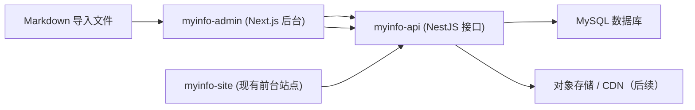
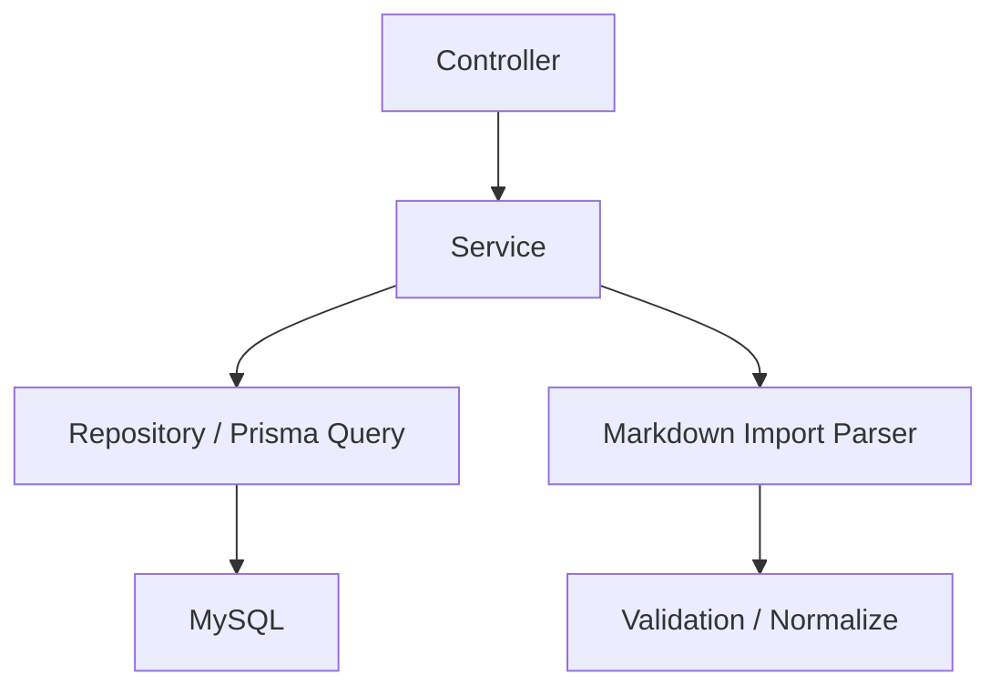
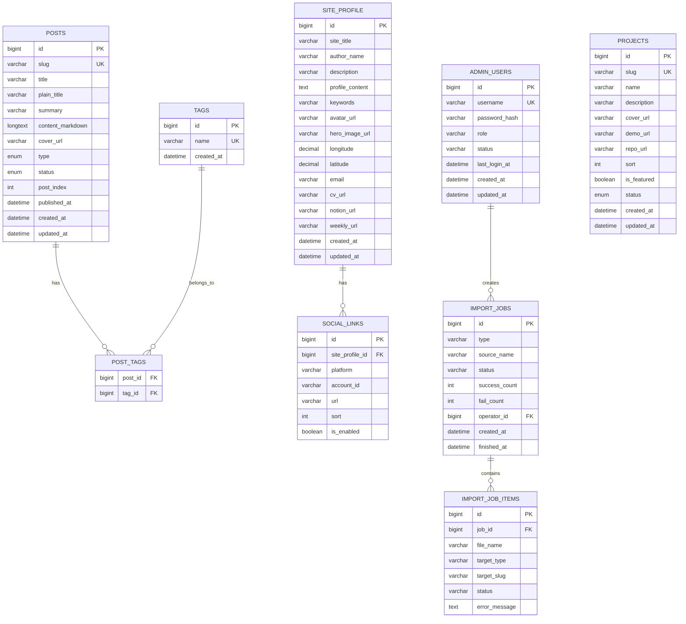

## 1. 架构设计



## 2. 技术描述
- 前台站点：现有 `myinfo-site`，`Next.js 16 + React 19 + TypeScript + Tailwind CSS + Yarn`
- 后台管理端：`Next.js 16 + React 19 + TypeScript + Tailwind CSS + ESLint + Prettier + Yarn`
- 后端接口：`NestJS 11 + TypeScript + Prisma + MySQL + class-validator + JWT`
- 包管理器：统一使用 `yarn@1.22.x`
- Node 版本：统一要求 `>=22.0.0`
- 代码规范：参考 `myinfo-site` 的 `Next.js 16` 规则，后台管理端沿用同类配置；接口项目保持同等严格度的 TypeScript、ESLint、脚本约束

## 3. 路由定义
| 路由 | 用途 |
|-------|---------|
| `/login` | 后台登录页 |
| `/dashboard` | 后台仪表盘 |
| `/posts` | 文章与日常管理列表 |
| `/posts/new` | 新建文章页 |
| `/posts/[id]` | 编辑文章页 |
| `/imports` | Markdown 导入中心 |
| `/projects` | 项目管理页 |
| `/settings/site` | 站点设置页 |
| `/settings/social-links` | 社交链接设置页 |

## 4. API 定义

### 4.1 公共接口

```ts
type PublicSiteResponse = {
  siteTitle: string
  authorName: string
  description: string
  profileContent: string
  keywords: string
  avatarUrl: string
  location: {
    longitude: number
    latitude: number
  }
  socialLinks: Array<{
    platform: string
    url: string
    accountId?: string
  }>
}

type PublicPostListItem = {
  id: number
  slug: string
  title: string
  plainTitle: string
  summary: string
  coverUrl?: string
  type: 'blog' | 'daily'
  status: 'draft' | 'published'
  postIndex: number
  publishedAt: string
  tags: string[]
}

type PublicPostsResponse = {
  list: PublicPostListItem[]
  pagination: {
    page: number
    pageSize: number
    total: number
  }
}

type PublicPostDetailResponse = PublicPostListItem & {
  contentMarkdown: string
}

type PublicProjectResponse = {
  id: number
  slug: string
  name: string
  description: string
  coverUrl?: string
  demoUrl?: string
  repoUrl?: string
  sort: number
  isFeatured: boolean
  status: 'draft' | 'published'
}
```

| 方法 | 路径 | 用途 |
|------|------|------|
| `GET` | `/api/public/site` | 获取站点信息与社交链接 |
| `GET` | `/api/public/posts` | 获取文章/日常列表，支持分页与筛选 |
| `GET` | `/api/public/posts/:slug` | 获取文章详情 |
| `GET` | `/api/public/tags` | 获取标签列表 |
| `GET` | `/api/public/projects` | 获取项目列表 |

### 4.2 后台接口

```ts
type AdminLoginRequest = {
  username: string
  password: string
}

type AdminLoginResponse = {
  accessToken: string
  refreshToken?: string
  user: {
    id: number
    username: string
    role: 'super_admin' | 'editor'
  }
}

type MarkdownImportPreviewItem = {
  fileName: string
  slug: string
  title: string
  type: 'blog' | 'daily'
  status: 'draft' | 'published'
  summary?: string
  tags: string[]
  coverUrl?: string
  isValid: boolean
  errors: string[]
}
```

| 方法 | 路径 | 用途 |
|------|------|------|
| `POST` | `/api/admin/auth/login` | 后台登录 |
| `GET` | `/api/admin/posts` | 获取后台文章列表 |
| `POST` | `/api/admin/posts` | 新建文章 |
| `PUT` | `/api/admin/posts/:id` | 更新文章 |
| `DELETE` | `/api/admin/posts/:id` | 删除文章 |
| `POST` | `/api/admin/posts/import-preview` | Markdown 导入预校验 |
| `POST` | `/api/admin/posts/import-markdown` | 确认导入 Markdown |
| `GET` | `/api/admin/projects` | 获取后台项目列表 |
| `POST` | `/api/admin/projects` | 新建项目 |
| `PUT` | `/api/admin/projects/:id` | 更新项目 |
| `DELETE` | `/api/admin/projects/:id` | 删除项目 |
| `GET` | `/api/admin/site/profile` | 获取站点资料 |
| `PUT` | `/api/admin/site/profile` | 更新站点资料 |
| `GET` | `/api/admin/social-links` | 获取社交链接 |
| `PUT` | `/api/admin/social-links` | 批量更新社交链接 |

## 5. 服务端架构图



## 6. 数据模型
### 6.1 数据模型定义



### 6.2 数据定义语言

```sql
CREATE TABLE posts (
  id BIGINT PRIMARY KEY AUTO_INCREMENT,
  slug VARCHAR(191) NOT NULL UNIQUE,
  title VARCHAR(191) NOT NULL,
  plain_title VARCHAR(191) NOT NULL,
  summary VARCHAR(500) NOT NULL,
  content_markdown LONGTEXT NOT NULL,
  cover_url VARCHAR(500) NULL,
  type ENUM('blog', 'daily') NOT NULL,
  status ENUM('draft', 'published') NOT NULL DEFAULT 'draft',
  post_index INT NOT NULL DEFAULT 0,
  published_at DATETIME NULL,
  created_at DATETIME NOT NULL DEFAULT CURRENT_TIMESTAMP,
  updated_at DATETIME NOT NULL DEFAULT CURRENT_TIMESTAMP ON UPDATE CURRENT_TIMESTAMP
);

CREATE TABLE tags (
  id BIGINT PRIMARY KEY AUTO_INCREMENT,
  name VARCHAR(100) NOT NULL UNIQUE,
  created_at DATETIME NOT NULL DEFAULT CURRENT_TIMESTAMP
);

CREATE TABLE post_tags (
  post_id BIGINT NOT NULL,
  tag_id BIGINT NOT NULL,
  PRIMARY KEY (post_id, tag_id),
  CONSTRAINT fk_post_tags_post FOREIGN KEY (post_id) REFERENCES posts(id) ON DELETE CASCADE,
  CONSTRAINT fk_post_tags_tag FOREIGN KEY (tag_id) REFERENCES tags(id) ON DELETE CASCADE
);

CREATE TABLE projects (
  id BIGINT PRIMARY KEY AUTO_INCREMENT,
  slug VARCHAR(191) NOT NULL UNIQUE,
  name VARCHAR(191) NOT NULL,
  description VARCHAR(500) NOT NULL,
  cover_url VARCHAR(500) NULL,
  demo_url VARCHAR(500) NULL,
  repo_url VARCHAR(500) NULL,
  sort INT NOT NULL DEFAULT 0,
  is_featured TINYINT(1) NOT NULL DEFAULT 0,
  status ENUM('draft', 'published') NOT NULL DEFAULT 'draft',
  created_at DATETIME NOT NULL DEFAULT CURRENT_TIMESTAMP,
  updated_at DATETIME NOT NULL DEFAULT CURRENT_TIMESTAMP ON UPDATE CURRENT_TIMESTAMP
);

CREATE TABLE site_profile (
  id BIGINT PRIMARY KEY AUTO_INCREMENT,
  site_title VARCHAR(191) NOT NULL,
  author_name VARCHAR(191) NOT NULL,
  description VARCHAR(500) NOT NULL,
  profile_content TEXT NOT NULL,
  keywords VARCHAR(500) NOT NULL,
  avatar_url VARCHAR(500) NULL,
  hero_image_url VARCHAR(500) NULL,
  longitude DECIMAL(10, 6) NULL,
  latitude DECIMAL(10, 6) NULL,
  email VARCHAR(191) NULL,
  cv_url VARCHAR(500) NULL,
  notion_url VARCHAR(500) NULL,
  weekly_url VARCHAR(500) NULL,
  created_at DATETIME NOT NULL DEFAULT CURRENT_TIMESTAMP,
  updated_at DATETIME NOT NULL DEFAULT CURRENT_TIMESTAMP ON UPDATE CURRENT_TIMESTAMP
);

CREATE TABLE social_links (
  id BIGINT PRIMARY KEY AUTO_INCREMENT,
  site_profile_id BIGINT NOT NULL,
  platform VARCHAR(100) NOT NULL,
  account_id VARCHAR(191) NULL,
  url VARCHAR(500) NOT NULL,
  sort INT NOT NULL DEFAULT 0,
  is_enabled TINYINT(1) NOT NULL DEFAULT 1,
  CONSTRAINT fk_social_links_site_profile FOREIGN KEY (site_profile_id) REFERENCES site_profile(id) ON DELETE CASCADE
);

CREATE TABLE admin_users (
  id BIGINT PRIMARY KEY AUTO_INCREMENT,
  username VARCHAR(100) NOT NULL UNIQUE,
  password_hash VARCHAR(255) NOT NULL,
  role ENUM('super_admin', 'editor') NOT NULL DEFAULT 'editor',
  status ENUM('enabled', 'disabled') NOT NULL DEFAULT 'enabled',
  last_login_at DATETIME NULL,
  created_at DATETIME NOT NULL DEFAULT CURRENT_TIMESTAMP,
  updated_at DATETIME NOT NULL DEFAULT CURRENT_TIMESTAMP ON UPDATE CURRENT_TIMESTAMP
);

CREATE TABLE import_jobs (
  id BIGINT PRIMARY KEY AUTO_INCREMENT,
  type VARCHAR(100) NOT NULL,
  source_name VARCHAR(255) NOT NULL,
  status ENUM('pending', 'success', 'failed', 'partial_success') NOT NULL DEFAULT 'pending',
  success_count INT NOT NULL DEFAULT 0,
  fail_count INT NOT NULL DEFAULT 0,
  operator_id BIGINT NOT NULL,
  created_at DATETIME NOT NULL DEFAULT CURRENT_TIMESTAMP,
  finished_at DATETIME NULL,
  CONSTRAINT fk_import_jobs_operator FOREIGN KEY (operator_id) REFERENCES admin_users(id)
);

CREATE TABLE import_job_items (
  id BIGINT PRIMARY KEY AUTO_INCREMENT,
  job_id BIGINT NOT NULL,
  file_name VARCHAR(255) NOT NULL,
  target_type VARCHAR(100) NOT NULL,
  target_slug VARCHAR(191) NULL,
  status ENUM('pending', 'success', 'failed') NOT NULL DEFAULT 'pending',
  error_message TEXT NULL,
  CONSTRAINT fk_import_job_items_job FOREIGN KEY (job_id) REFERENCES import_jobs(id) ON DELETE CASCADE
);
```

